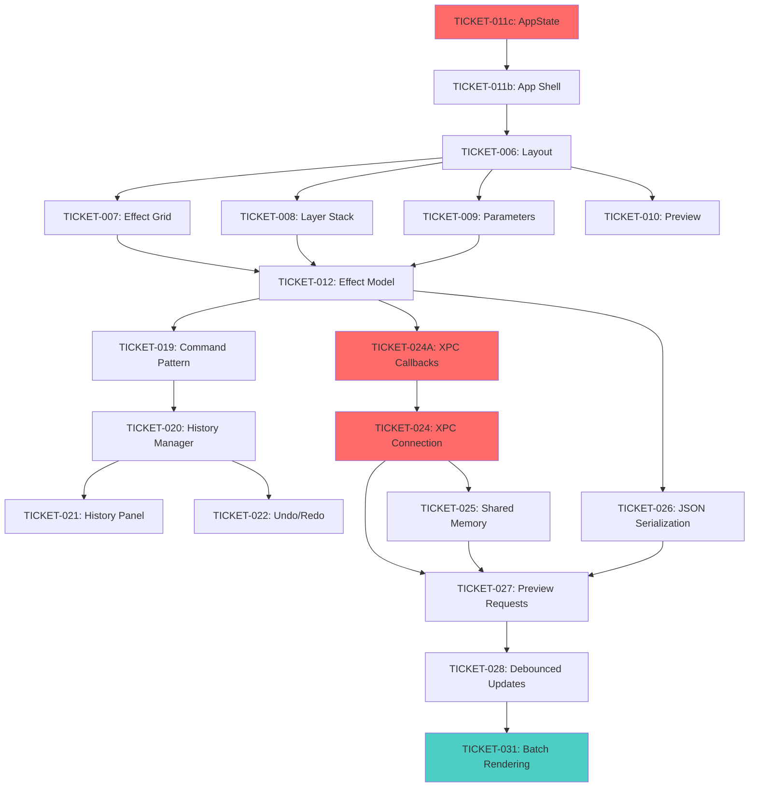

# SevenRad Video Frame Processor - Implementation Plan

**Version:** 1.0.0
**Last Updated:** 2025-10-25
**Status:** Active Development

---

## Table of Contents

1. [Overview](#1-overview)
2. [Technology Stack](#2-technology-stack)
3. [Architectural Decisions](#3-architectural-decisions)
4. [Development Phases](#4-development-phases)
5. [Dependency Graph](#5-dependency-graph)
6. [Testing Strategy](#6-testing-strategy)
7. [Git Workflow](#7-git-workflow)
8. [Developer Onboarding](#8-developer-onboarding)
9. [File Structure](#9-file-structure)
10. [Success Metrics](#10-success-metrics)

---

## 1. Overview

### 1.1 Project Vision

SevenRad Video Frame Processor is a macOS application for extracting video frames and applying algorithmic transformations through GPU-accelerated effect pipelines. The application draws inspiration from the **Elektron RYTM** drum machine, featuring a tactile 16-pad effect grid, visual layer stacking, and pattern sequencer-style frame control.

The project explores **poetic interpretations of digital media** through algorithmic transformation, channeling the voices of Rimbaud and Dominique de Groen—using clinical, marketing-inspired language and exhaustive repetition to offer critical analysis of late-stage capitalism, ecological crises, and exploitation.

### 1.2 Core Principles

- **Non-Destructive Editing**: All image processing preserves originals with incremental filename versioning
- **RYTM-Inspired UX**: Hardware-style interface with 4-panel layout, 16-pad effect grid, and OLED aesthetics
- **GPU Acceleration**: Taichi and MLX frameworks for real-time effect rendering
- **MECE Organization**: Mutually Exclusive, Collectively Exhaustive epic and ticket structure
- **Poetic Computation**: Technical excellence serving artistic exploration and critical commentary

### 1.3 Architecture Summary

```
┌─────────────────────────────────────────────────────┐
│  macOS SwiftUI Frontend (Swift 5.9+)               │
│  • 4-Panel RYTM Layout                              │
│  • Command Pattern (Undo/Redo)                      │
│  • Centralized State Management                     │
└───────────────┬─────────────────────────────────────┘
                │ XPC (async/await + callbacks)
                │ Shared Memory (zero-copy images)
┌───────────────▼─────────────────────────────────────┐
│  Python Backend (Python 3.11+)                      │
│  • Taichi GPU Kernels                               │
│  • MLX Framework Integration                        │
│  • YAML Pipeline Serialization                      │
└─────────────────────────────────────────────────────┘
```

**Key Interfaces:**
- XPC Service: Request/response with JSON serialization
- Shared Memory: POSIX shm for RGBA image buffers
- File System: Session directories with incremental versioning

---

## 2. Technology Stack

### 2.1 Frontend

| Component | Technology | Version | Purpose |
|-----------|-----------|---------|---------|
| UI Framework | SwiftUI | macOS 13.0+ | Declarative UI with native macOS integration |
| Language | Swift | 5.9+ | Type-safe, modern language with Combine support |
| State Management | Combine + ObservableObject | Native | Reactive state updates and debouncing |
| Graphics | Core Graphics | Native | Image display and shared memory conversion |
| IPC | XPC (NSXPCConnection) | Native | Cross-process communication with Python |
| Build System | Xcode | 15.0+ | Native macOS development tooling |

### 2.2 Backend

| Component | Technology | Version | Purpose |
|-----------|-----------|---------|---------|
| Language | Python | 3.11+ | Rapid prototyping, rich ecosystem |
| GPU Compute | Taichi | Latest | GPU kernel compilation for effects |
| ML Framework | MLX | Latest | Apple Silicon GPU acceleration |
| Video Processing | FFmpeg (via ffmpeg-python) | Latest | Frame extraction and metadata inspection |
| Image Manipulation | Pillow + scikit-image | Latest | Image I/O and algorithmic processing |
| Serialization | YAML + JSON | PyYAML | Pipeline persistence and XPC messages |
| Package Manager | uv | Latest | Fast dependency resolution |
| Environment | venv | Python 3.11+ | Isolated virtual environment |

### 2.3 Development Tools

| Tool | Purpose |
|------|---------|
| Git + GitHub | Version control and collaboration |
| pytest | Python unit and integration testing |
| XCTest | Swift unit testing |
| mypy | Python static type checking |
| ruff | Python code formatting (PEP 8) |
| SwiftLint | Swift code style enforcement |

---

## 3. Architectural Decisions

### 3.1 Command Pattern for Undo/Redo

**Decision:** Use replay-based undo, NOT snapshot-based.

**Rationale:**
- Memory efficient: Store deltas, not full pipeline snapshots
- Simplifies command implementation: No need for inverse operations
- Enables time-travel: Jump to any history state by replaying commands

**Implementation:**
- Commands store minimal state deltas (e.g., "Add effect: Saturation at index 2")
- Undo: Reset pipeline to initial state + replay commands[0:targetIndex]
- Redo: Replay commands[currentIndex:targetIndex]

**Tradeoffs:**
- Pro: Small memory footprint, simple command API
- Con: Undo requires full pipeline replay (acceptable for <100 effects)

### 3.2 XPC Communication Layer

**Decision:** Async/await with callback-based progress updates.

**Request ID Tracking:**
```swift
struct XPCRequest {
    let method: String
    let params: [String: Any]
    let requestID: UUID  // Generated by frontend
}

struct XPCResponse {
    let requestID: UUID  // Echoed from request
    let status: "success" | "error"
    let result: Any?
    let error: BackendError?
}
```

**Progress Callbacks:**
- Long operations (>500ms) send progress updates
- Frontend tracks callbacks via request ID dictionary
- Throttle progress updates to 10/sec max for UI responsiveness

### 3.3 Centralized State Management

**Decision:** Single ObservableObject (AppState) with ViewModel layer.

**Architecture:**
```swift
// Data layer (no business logic)
@MainActor
class AppState: ObservableObject {
    @Published var session: Session?
    @Published var currentFrame: Frame?
    @Published var effectLayers: [EffectLayer]
    @Published var selectedLayerIndex: Int?
}

// Business logic layer
@MainActor
class MainViewModel {
    weak var state: AppState?

    func addEffect(_ effect: Effect) { /* Command execution */ }
    func removeLayer(at index: Int) { /* Command execution */ }
}
```

**Benefits:**
- Clear separation: State holds data, ViewModel holds operations
- Testable: Mock AppState for ViewModel tests
- SwiftUI-native: @EnvironmentObject propagates state

### 3.4 Shared Memory Image Transfer

**Decision:** POSIX shared memory for zero-copy preview rendering.

**Workflow:**
1. Frontend creates named shared memory buffer (UUID-based name)
2. Frontend sends XPC request with buffer ID
3. Backend renders to shared memory (RGBA format, premultiplied alpha)
4. Frontend reads buffer and converts to CGImage
5. Frontend cleans up buffer after display

**Image Format:**
- Pixel Format: RGBA (4 bytes/pixel)
- Byte Order: Red, Green, Blue, Alpha
- Color Space: sRGB
- Alignment: No padding (stride = width × 4)

### 3.5 Incremental Filename Versioning

**Decision:** Non-destructive editing with auto-incrementing version numbers.

**Format:** `{pipeline_name}_{frame_stem}_v{version:03d}.{ext}`

**Examples:**
```
saturation_frame_0001_v001.png  # First render
saturation_frame_0001_v002.png  # Second render (parameters changed)
blur_frame_0001_v001.png        # Different pipeline
```

**Implementation:**
- Scan output directory for existing files matching pattern
- Extract max version number
- Increment for new render
- Never overwrite existing files

---

## 4. Development Phases

### 4.1 Phase 1: Core Foundation (Weeks 1-4)

**Goal:** Establish basic video loading, frame extraction, and effect application workflow.

**Epics:** EPIC-001, EPIC-002, EPIC-003

#### 4.1.1 EPIC-001: Video Source & Frame Extraction

**Tickets (13 points):**
- TICKET-001: YouTube URL Input & Validation (2 pts)
- TICKET-002: Local Video File Picker (1 pt)
- TICKET-003: Video Metadata Display (2 pts)
- TICKET-004: Timeline Scrubber Component (5 pts)
- TICKET-005: Frame Extraction Service Integration (3 pts)

**Milestone:** User can load video, select segment, extract frames to session directory.

#### 4.1.2 EPIC-002: Core UI Shell

**Tickets (21 points):**
- TICKET-011b: Application Shell & Menu Bar (3 pts)
- TICKET-011c: Application State Management & View Model (5 pts)
- TICKET-006: Main Window Layout Structure (3 pts)
- TICKET-007: 16-Pad Effect Grid Component (4 pts)
- TICKET-008: Layer Stack Panel Component (3 pts)
- TICKET-009: Parameter Panel Component (2 pts)
- TICKET-010: Preview Window Component (1 pt)

**Milestone:** UI displays with all panels, but no backend integration yet.

**Critical Path:**
```
TICKET-011c (AppState) → TICKET-011b (App Shell) → TICKET-006 (Layout) → TICKET-007/008/009/010 (Panels)
```

#### 4.1.3 EPIC-003: Effect Pipeline Management

**Tickets (Estimated 18 points):**
- TICKET-012: Effect Model and Registry (3 pts)
- TICKET-013: Add Effect to Pipeline Action (2 pts)
- TICKET-014: Layer Reordering (Drag-and-Drop) (4 pts)
- TICKET-015: Layer Selection and Highlighting (2 pts)
- TICKET-016: Remove Layer Action (1 pt)
- TICKET-017: Parameter Binding and Validation (4 pts)
- TICKET-018: Repeat Count Configuration (2 pts)

**Milestone:** User can build effect chain, reorder layers, adjust parameters (local state only).

### 4.2 Phase 2: History & Rendering (Weeks 5-8)

**Goal:** Implement undo/redo, connect backend, enable preview rendering and export.

**Epics:** EPIC-004, EPIC-005, EPIC-006

#### 4.2.1 EPIC-004: History Panel & Undo/Redo

**Tickets (Estimated 15 points):**
- TICKET-019: Command Pattern Infrastructure (4 pts)
- TICKET-020: History State Manager (3 pts)
- TICKET-021: History Panel UI Component (3 pts)
- TICKET-022: Undo/Redo Keyboard Shortcuts (2 pts)
- TICKET-023: Time-Travel State Restoration (3 pts)

**Milestone:** Full undo/redo with history panel showing all actions.

#### 4.2.2 EPIC-005: Preview Rendering & Backend Integration

**Tickets (Estimated 20 points):**
- TICKET-024A: XPC Callback Handler (NEW, 3 pts)
- TICKET-024: XPC Connection & Communication (4 pts)
- TICKET-025: Shared Memory Buffer Implementation (5 pts)
- TICKET-026: Pipeline JSON Serialization (2 pts)
- TICKET-027: Preview Request/Response Handling (3 pts)
- TICKET-028: Real-Time Preview Updates (2 pts)
- TICKET-029: Error Handling and Retry Logic (1 pt)

**Milestone:** Preview updates within 1s of parameter changes via XPC.

**Critical Path:**
```
TICKET-024A (Callbacks) → TICKET-024 (XPC) → TICKET-025 (Shared Mem) → TICKET-027 (Preview) → TICKET-028 (Debounce)
```

#### 4.2.3 EPIC-006: Export & Rendering

**Tickets (Estimated 16 points):**
- TICKET-030: YAML Pipeline Export (2 pts)
- TICKET-031: Batch Rendering Queue (5 pts)
- TICKET-032: Progress Tracking UI (3 pts)
- TICKET-033: Export Dialog UI (3 pts)
- TICKET-034: Finder Integration for Exports (3 pts)

**Milestone:** Can export YAML and render full frame sequences with progress tracking.

### 4.3 Phase 3: Polish & UX (Weeks 9-10)

**Goal:** Production-ready MVP with polished animations, accessibility, and error handling.

**Epic:** EPIC-007

**Tickets (Estimated 14 points):**
- TICKET-035: Keyboard Navigation (4 pts)
- TICKET-036: Tooltips and Help Text (3 pts)
- TICKET-037: Error Message Refinement (2 pts)
- TICKET-038: Smooth Animations and Transitions (3 pts)
- TICKET-039: Accessibility Features (2 pts)

**Milestone:** Polished UX with keyboard navigation, tooltips, smooth animations, WCAG 2.1 AA compliance.

### 4.4 Phase 4: Advanced Features (Weeks 11-14)

**Goal:** Power-user features matching RYTM capabilities.

**Epics:** EPIC-008, EPIC-009, EPIC-010 (if exists)

#### 4.4.1 EPIC-008: Frame-Level Step Sequencer

**Tickets (Estimated 18 points):**
- TICKET-041: Frame Timeline Component (3 pts)
- TICKET-042: Step Sequencer Grid Component (5 pts)
- TICKET-043: Playback Controls (3 pts)
- TICKET-044: Frame Override Data Model (3 pts)
- TICKET-045: Step Sequencer Preview Integration (4 pts)

**Milestone:** Per-frame effect toggles with playback preview.

#### 4.4.2 EPIC-009: Scene Preset System

**Tickets (Estimated 16 points):**
- TICKET-046: Scene Slot UI Component (3 pts)
- TICKET-047: Scene Save Operation (3 pts)
- TICKET-048: Scene Load Operation (3 pts)
- TICKET-049: Scene Management Operations (4 pts)
- TICKET-050: Scene Comparison View (3 pts)

**Milestone:** Save/load preset effect chains to 12 scene slots.

---

## 5. Dependency Graph

### 5.1 Critical Path

The following tickets form the critical path through the MVP:

```
TICKET-011c (AppState)
  → TICKET-011b (App Shell)
    → TICKET-006 (Layout)
      → TICKET-007 (Effect Grid) + TICKET-010 (Preview)
        → TICKET-012 (Effect Model)
          → TICKET-024A (XPC Callbacks)
            → TICKET-024 (XPC Connection)
              → TICKET-025 (Shared Memory)
                → TICKET-027 (Preview Rendering)
                  → TICKET-028 (Debounced Updates)
                    → TICKET-031 (Batch Rendering)
```

**Estimated Duration (Critical Path Only):** ~6-8 weeks with serial execution.

### 5.2 Parallel Development Tracks

**Track 1: UI Components (EPIC-002)**
- Can start immediately after TICKET-011c
- TICKET-007, 008, 009, 010 can be developed in parallel
- Dependencies: All require AppState and Layout (TICKET-006)

**Track 2: Backend Integration (EPIC-005)**
- Can start after TICKET-024A is complete
- TICKET-024, 025, 026 can be developed in parallel
- TICKET-027, 028, 029 depend on TICKET-024 + 025

**Track 3: History System (EPIC-004)**
- Can start after TICKET-012 (Effect Model)
- TICKET-019, 020, 021 can be developed in parallel
- TICKET-022, 023 depend on TICKET-020

### 5.3 Dependency Diagram



**Legend:**
- Red nodes: Blocking tickets (must complete before parallel work)
- Green nodes: Final deliverables

### 5.4 Blocking Tickets

These tickets must be completed before other work can proceed:

1. **TICKET-011c** (AppState): Blocks entire UI layer
2. **TICKET-011b** (App Shell): Blocks window and menu system
3. **TICKET-006** (Layout): Blocks all panel components
4. **TICKET-012** (Effect Model): Blocks history and backend integration
5. **TICKET-024A** (XPC Callbacks): Blocks all backend communication
6. **TICKET-024** (XPC Connection): Blocks rendering
7. **TICKET-025** (Shared Memory): Blocks preview updates

---

## 6. Testing Strategy

### 6.1 Unit Tests

#### 6.1.1 Swift Tests (XCTest)

**Coverage Requirements:** 80%+ for models and view models.

**Test Suites:**
```swift
// Tests/ModelTests/EffectModelTests.swift
class EffectModelTests: XCTestCase {
    func testEffectSerialization() { /* JSON encoding/decoding */ }
    func testParameterValidation() { /* Range checks */ }
}

// Tests/ViewModelTests/MainViewModelTests.swift
class MainViewModelTests: XCTestCase {
    func testAddLayer() { /* Verify layer appended to state */ }
    func testRemoveLayer() { /* Verify layer removed */ }
    func testReorderLayer() { /* Verify index swap */ }
}

// Tests/CommandTests/CommandPatternTests.swift
class CommandPatternTests: XCTestCase {
    func testAddEffectCommand() { /* Verify execute() adds effect */ }
    func testCommandReplay() { /* Verify undo via replay */ }
}

// Tests/StateTests/AppStateTests.swift
class AppStateTests: XCTestCase {
    func testStateInitialization() { /* Default values */ }
    func testPublishedUpdates() { /* Combine notifications */ }
}
```

#### 6.1.2 Python Tests (pytest)

**Coverage Requirements:** 80%+ for backend API and effects.

**Test Suites:**
```python
# backend/tests/test_effects.py
def test_saturation_effect():
    """Test saturation effect with valid parameters."""
    result = apply_saturation(image, factor=1.5)
    assert result.shape == image.shape

def test_invalid_parameter():
    """Test parameter validation rejects out-of-range values."""
    with pytest.raises(ValueError):
        apply_saturation(image, factor=5.0)  # Max is 3.0

# backend/tests/test_api.py
def test_render_preview_success():
    """Test successful preview render to shared memory."""
    response = backend.handle_request({
        "method": "render_preview",
        "params": {...},
        "request_id": "test_001"
    })
    assert response["status"] == "success"
    assert response["result"]["render_time_ms"] < 1000

# backend/tests/test_pipeline.py
def test_pipeline_serialization():
    """Test YAML round-trip preserves pipeline structure."""
    pipeline = Pipeline(effects=[...])
    yaml_str = pipeline.to_yaml()
    restored = Pipeline.from_yaml(yaml_str)
    assert restored == pipeline
```

### 6.2 Integration Tests

#### 6.2.1 XPC Communication Tests

**Goal:** Verify Swift ↔ Python communication correctness.

```swift
// Tests/IntegrationTests/XPCIntegrationTests.swift
class XPCIntegrationTests: XCTestCase {
    var xpcClient: XPCClient!

    override func setUp() {
        xpcClient = XPCClient()
        xpcClient.connect()
    }

    func testRenderPreviewRoundTrip() async throws {
        let pipeline = Pipeline(effects: [
            Effect(name: "saturation", params: ["factor": 1.5])
        ])

        let result = try await xpcClient.renderPreview(
            framePath: "/test/frame.png",
            pipeline: pipeline
        )

        XCTAssertLessThan(result.renderTimeMs, 2000)
        XCTAssertEqual(result.resolution.width, 960)
    }

    func testProgressCallbacks() async throws {
        var progressUpdates: [ProgressUpdate] = []

        let result = try await xpcClient.renderSequence(
            framePaths: testFramePaths,
            pipeline: testPipeline,
            progress: { progressUpdates.append($0) }
        )

        XCTAssertGreaterThan(progressUpdates.count, 0)
        XCTAssertEqual(progressUpdates.last?.percent, 100.0)
    }
}
```

#### 6.2.2 Shared Memory Tests

**Goal:** Verify image correctness across process boundary.

```python
# backend/tests/test_shared_memory.py
def test_shared_memory_image_transfer():
    """Test image data integrity across shared memory."""
    # Create test image
    width, height = 960, 540
    test_image = np.random.randint(0, 256, (height, width, 4), dtype=np.uint8)

    # Write to shared memory
    buffer_id = "test_buffer_001"
    shm = SharedMemory(buffer_id, width * height * 4)
    shm.write(test_image.tobytes())

    # Read from Swift side (simulated)
    read_data = shm.read()
    read_image = np.frombuffer(read_data, dtype=np.uint8).reshape((height, width, 4))

    # Verify pixel-perfect match
    assert np.array_equal(test_image, read_image)
```

#### 6.2.3 Pipeline YAML Round-Trip Tests

**Goal:** Verify serialization preserves all data.

```swift
// Tests/IntegrationTests/PipelineSerializationTests.swift
func testYAMLRoundTrip() throws {
    let originalPipeline = Pipeline(
        source: Source(type: .youtube, path: "https://..."),
        effects: [
            Effect(id: UUID(), name: "saturation", enabled: true, repeat: 4, params: ["factor": 1.5]),
            Effect(id: UUID(), name: "blur", enabled: false, repeat: 1, params: ["radius": 3.0])
        ]
    )

    // Export to YAML
    let yamlURL = try originalPipeline.exportToYAML(path: "/tmp/test.yaml")

    // Import from YAML
    let importedPipeline = try Pipeline.importFromYAML(path: yamlURL.path)

    // Verify equality
    XCTAssertEqual(originalPipeline.effects.count, importedPipeline.effects.count)
    XCTAssertEqual(originalPipeline.effects[0].name, importedPipeline.effects[0].name)
    XCTAssertEqual(originalPipeline.effects[0].params["factor"] as? Double, 1.5)
}
```

### 6.3 End-to-End Tests

**Goal:** Verify complete user workflows.

```swift
// Tests/E2ETests/VideoProcessingWorkflowTests.swift
class VideoProcessingWorkflowTests: XCTestCase {
    func testCompleteVideoWorkflow() async throws {
        // 1. Load video
        let session = try await sessionManager.createSession()
        let videoURL = Bundle.test.url(forResource: "test_video", withExtension: "mp4")!
        try await sessionManager.loadVideo(url: videoURL, session: session)

        // 2. Extract frames
        let frames = try await sessionManager.extractFrames(
            session: session,
            startTime: 10.0,
            endTime: 15.0,
            interval: 1.0
        )
        XCTAssertEqual(frames.count, 5)

        // 3. Build effect pipeline
        viewModel.addEffect(Effect(name: "saturation", params: ["factor": 1.5]))
        viewModel.addEffect(Effect(name: "blur", params: ["radius": 3.0]))

        // 4. Render preview
        let preview = try await viewModel.renderPreview(frameIndex: 0)
        XCTAssertNotNil(preview)

        // 5. Export to YAML
        let yamlURL = try await viewModel.exportPipeline()
        XCTAssertTrue(FileManager.default.fileExists(atPath: yamlURL.path))

        // 6. Batch render all frames
        let renderResults = try await viewModel.renderSequence()
        XCTAssertEqual(renderResults.count, 5)

        // 7. Verify output files exist
        for result in renderResults {
            XCTAssertTrue(FileManager.default.fileExists(atPath: result.outputPath))
        }
    }

    func testUndoRedoCorrectness() async throws {
        // Execute 20 commands
        for i in 0..<20 {
            viewModel.addEffect(Effect(name: "saturation", params: ["factor": Double(i) / 20.0]))
        }

        // Undo 10 times
        for _ in 0..<10 {
            viewModel.undo()
        }
        XCTAssertEqual(viewModel.effectLayers.count, 10)

        // Redo 5 times
        for _ in 0..<5 {
            viewModel.redo()
        }
        XCTAssertEqual(viewModel.effectLayers.count, 15)

        // Verify state matches expected
        XCTAssertEqual(viewModel.effectLayers.last?.params["factor"] as? Double, 14.0 / 20.0)
    }

    func testStepSequencerPlayback() async throws {
        // Create sequence with frame overrides
        viewModel.addEffect(Effect(name: "saturation", params: ["factor": 1.5]))

        // Disable effect on frames 2 and 4
        viewModel.setEffectOverride(frameIndex: 2, effectID: effect.id, enabled: false)
        viewModel.setEffectOverride(frameIndex: 4, effectID: effect.id, enabled: false)

        // Render sequence
        let results = try await viewModel.renderSequence()

        // Verify frames 2 and 4 are unprocessed (saturation skipped)
        // This requires comparing output to original frames
        let frame2Original = try loadImage(session.frames[2].path)
        let frame2Rendered = try loadImage(results[2].outputPath)
        XCTAssertTrue(imagesEqual(frame2Original, frame2Rendered))
    }
}
```

### 6.4 Manual Testing

#### 6.4.1 Accessibility Testing

**Tools:** macOS VoiceOver, Keyboard-only navigation

**Test Cases:**
- [ ] All UI elements have accessible labels
- [ ] Focus order follows logical flow (Tab: Grid → Layers → Parameters → Transport)
- [ ] All actions accessible via keyboard (no mouse-only operations)
- [ ] VoiceOver announces state changes ("Layer added", "Effect enabled")
- [ ] Focus indicators meet WCAG 2.1 AA contrast requirements (3:1 minimum)
- [ ] Reduced motion preference respected (disable animations)
- [ ] High contrast mode supported

#### 6.4.2 Performance Testing

**Metrics:**
- [ ] UI animations run at 60fps (no dropped frames)
- [ ] Preview renders complete in <1s (960×540 resolution)
- [ ] Full frame renders complete in <5s (1920×1080 resolution)
- [ ] Undo/redo operates in <100ms for 100-command history
- [ ] Step sequencer playback maintains 30fps at 1x speed

**Tools:** Xcode Instruments (Time Profiler, Allocations)

#### 6.4.3 UX Testing

**Test Scenarios:**
- [ ] First-time user can load video and extract frames without documentation
- [ ] User can build 10-effect pipeline with parameter adjustments
- [ ] User can undo/redo without confusion
- [ ] Error messages provide clear next steps
- [ ] Export dialog makes output location obvious
- [ ] Tooltips appear within 500ms hover time

**Success Criteria:** 90%+ task completion rate in usability testing.

---

## 7. Git Workflow

### 7.1 Branch Naming

**Format:** `feature/TICKET-XXX-brief-description`

**Examples:**
```
feature/TICKET-011c-app-state-management
feature/TICKET-024-xpc-connection
feature/TICKET-031-batch-rendering
```

**Branch Types:**
- `feature/` - New functionality
- `bugfix/` - Bug fixes
- `refactor/` - Code improvements without behavior changes
- `docs/` - Documentation updates

### 7.2 Commit Message Format

**Format:** `[TICKET-XXX] Brief description`

**Examples:**
```
[TICKET-011c] Implement AppState with Combine publishers
[TICKET-024] Add XPC connection manager with retry logic
[TICKET-031] Implement incremental filename versioning
```

**Multi-ticket commits:**
```
[TICKET-011c, TICKET-011b] Wire AppState to App Shell
```

### 7.3 Pull Request Requirements

**Checklist:**
- [ ] All tests pass (unit + integration)
- [ ] Code follows style guide (SwiftLint, ruff)
- [ ] Accessibility labels added to new UI components
- [ ] MECE review: Ticket fully implements acceptance criteria
- [ ] No conflicts with main branch
- [ ] PR description references epic and blocking/blocked tickets

**PR Template:**
```markdown
## Ticket
Closes #TICKET-XXX

## Epic
Part of EPIC-00X: [Epic Name]

## Changes
- Brief summary of implementation
- Notable design decisions

## Testing
- Unit tests: [pass/fail]
- Integration tests: [pass/fail]
- Manual testing: [describe]

## Accessibility
- Keyboard navigation: [tested/not applicable]
- VoiceOver: [tested/not applicable]

## Dependencies
- Blocks: TICKET-YYY, TICKET-ZZZ
- Blocked by: [none / TICKET-AAA]
```

### 7.4 Branch Protection

**Main Branch Rules:**
- Require 1 reviewer approval
- All CI checks must pass (tests, linting, type checking)
- No force pushes
- No direct commits (PR required)

**CI Checks:**
- Swift: XCTest suite
- Python: pytest suite
- Swift: SwiftLint
- Python: ruff format check + mypy type check

### 7.5 Merge Strategy

**Strategy:** Squash and merge

**Rationale:**
- Clean commit history on main
- Each PR = 1 commit = 1 ticket
- Easy to revert entire features

**Commit Message (Auto-generated):**
```
[TICKET-XXX] Brief description (#PR-number)

* Detailed PR description preserved here
* All review comments addressed
```

---

## 8. Developer Onboarding

### 8.1 Prerequisites

**Required Software:**
- macOS 13.0+ (Ventura or later)
- Xcode 15.0+ (install from App Store)
- Python 3.11+ (install via Homebrew: `brew install python@3.11`)
- Git (bundled with Xcode Command Line Tools)

**Recommended Tools:**
- Xcode Command Line Tools: `xcode-select --install`
- Homebrew: `/bin/bash -c "$(curl -fsSL https://raw.githubusercontent.com/Homebrew/install/HEAD/install.sh)"`

### 8.2 Initial Setup

```bash
# 1. Clone repository
git clone https://github.com/antonbossenbroek/sevenrad-video.git
cd sevenrad-video

# 2. Install Python dependencies
make setup
# This runs: uv venv && source .venv/bin/activate && uv pip install -r requirements.txt

# 3. Install Swift dependencies (handled by Xcode)
open SevenRadVideo.xcodeproj
# Xcode will resolve Swift Package Manager dependencies automatically

# 4. Run tests to verify setup
make test-swift  # Swift tests
make test-python # Python tests
```

### 8.3 Repository Tour

**Key Files to Read:**
1. `/Users/antonbossenbroek/Documents_local/photo/7rad/video/CLAUDE.md` - Project principles and style guide
2. `/Users/antonbossenbroek/Documents_local/photo/7rad/video/docs/IMPLEMENTATION_PLAN.md` - This document
3. `/Users/antonbossenbroek/Documents_local/photo/7rad/video/docs/api/backend-contract.md` - XPC API specification
4. `/Users/antonbossenbroek/Documents_local/photo/7rad/video/docs/design/keyboard-shortcuts.md` - Shortcut registry

**Documentation Structure:**
```
docs/
├── epics/           # EPIC-001 to EPIC-009 (high-level features)
├── tickets/         # TICKET-001 to TICKET-050 (implementation tasks)
├── api/             # backend-contract.md (XPC protocol)
├── design/          # keyboard-shortcuts.md (UX reference)
└── mockups/         # HTML mockups for UI reference
```

### 8.4 Development Workflow

**1. Pick a Ticket:**
```bash
# Find unassigned tickets in current phase
grep -r "Status: Not Started" docs/tickets/

# Check dependencies
grep -r "Depends:" docs/tickets/TICKET-XXX.md
```

**2. Create Feature Branch:**
```bash
git checkout -b feature/TICKET-XXX-brief-description
```

**3. Implement:**
- Follow acceptance criteria in ticket
- Write tests as you code (TDD encouraged)
- Run tests frequently: `make test-swift` or `make test-python`

**4. Commit:**
```bash
git add .
git commit -m "[TICKET-XXX] Brief description"
```

**5. Push and Create PR:**
```bash
git push origin feature/TICKET-XXX-brief-description
# Open PR on GitHub, fill out template
```

**6. Address Review Feedback:**
```bash
# Make changes
git add .
git commit -m "[TICKET-XXX] Address review feedback"
git push
```

**7. Merge:**
- Reviewer approves
- CI passes
- Squash and merge to main

### 8.5 Common Commands

**Swift Development:**
```bash
make test-swift           # Run all Swift tests
make lint-swift           # Run SwiftLint
make build-release        # Build release configuration
```

**Python Development:**
```bash
make test-python          # Run pytest suite
make format-python        # Format with ruff
make typecheck-python     # Run mypy
source .venv/bin/activate # Activate venv
```

**Documentation:**
```bash
make docs-serve           # Start Jekyll server at localhost:4000
make docs-check-images    # Validate tutorial images
```

**Git:**
```bash
git checkout main         # Switch to main branch
git pull origin main      # Get latest changes
git branch -d feature/... # Delete merged branch
```

---

## 9. File Structure

```
/Users/antonbossenbroek/Documents_local/photo/7rad/video/
│
├── docs/                           # Documentation (epics, tickets, API specs)
│   ├── epics/                      # EPIC-001.md to EPIC-009.md
│   ├── tickets/                    # TICKET-001.md to TICKET-050.md
│   ├── api/                        # backend-contract.md (XPC protocol)
│   ├── design/                     # keyboard-shortcuts.md, design-system.md
│   ├── mockups/                    # HTML UI mockups for reference
│   └── IMPLEMENTATION_PLAN.md      # This document
│
├── src/                            # Swift source code (macOS app)
│   ├── App/
│   │   ├── VideoEffectApp.swift   # @main entry point
│   │   └── AppCommands.swift      # Menu bar commands
│   ├── State/
│   │   └── AppState.swift         # Centralized ObservableObject
│   ├── ViewModels/
│   │   └── MainViewModel.swift    # Business logic layer
│   ├── Views/
│   │   ├── MainWindowView.swift   # 4-panel layout
│   │   ├── EffectGridView.swift   # 16-pad effect selector
│   │   ├── LayerStackView.swift   # Effect layer list
│   │   ├── ParameterPanelView.swift
│   │   └── PreviewView.swift
│   ├── Models/
│   │   ├── Effect.swift           # Effect struct with Codable
│   │   ├── Pipeline.swift         # Pipeline model
│   │   └── Session.swift          # Session metadata
│   ├── Commands/
│   │   ├── Command.swift          # Command protocol
│   │   ├── AddEffectCommand.swift
│   │   └── RemoveEffectCommand.swift
│   ├── XPC/
│   │   ├── XPCClient.swift        # XPC connection manager
│   │   ├── XPCCallbackHandler.swift
│   │   └── SharedMemory.swift     # POSIX shared memory wrapper
│   └── Utilities/
│       ├── ColorExtensions.swift
│       └── GeometryUtils.swift
│
├── backend/                        # Python backend (XPC service)
│   ├── api.py                      # XPC request handler
│   ├── effects/
│   │   ├── saturation.py           # Taichi kernel implementations
│   │   ├── blur.py
│   │   └── ...
│   ├── pipeline.py                 # Pipeline execution engine
│   ├── shared_memory.py            # Shared memory writer
│   └── session.py                  # Session management
│
├── tests/                          # Test suites
│   ├── Swift/
│   │   ├── ModelTests/
│   │   ├── ViewModelTests/
│   │   ├── CommandTests/
│   │   └── IntegrationTests/
│   └── Python/
│       ├── test_effects.py
│       ├── test_api.py
│       └── test_pipeline.py
│
├── Resources/                      # Assets and resources
│   ├── Assets.xcassets/
│   └── Localizable.strings
│
├── SevenRadVideo.xcodeproj/        # Xcode project
├── pyproject.toml                  # Python dependencies and config
├── requirements.txt                # Python requirements (generated by uv)
├── Makefile                        # Build automation
├── CLAUDE.md                       # Project principles
└── README.md                       # Project overview
```

### 9.1 Swift Code Organization

**Naming Conventions:**
- Views: `*View.swift` (e.g., `EffectGridView.swift`)
- View Models: `*ViewModel.swift` (e.g., `MainViewModel.swift`)
- Models: Singular nouns (e.g., `Effect.swift`, `Pipeline.swift`)
- Commands: `*Command.swift` (e.g., `AddEffectCommand.swift`)

**File Structure (Example):**
```swift
// src/Models/Effect.swift

import Foundation

/// Represents a single image processing effect with parameters.
struct Effect: Identifiable, Codable {
    let id: UUID
    let name: String
    var enabled: Bool
    var repeatCount: Int
    var params: [String: AnyCodable]

    enum CodingKeys: String, CodingKey {
        case id, name, enabled
        case repeatCount = "repeat"
        case params
    }
}
```

### 9.2 Python Code Organization

**Naming Conventions:**
- Modules: lowercase with underscores (e.g., `shared_memory.py`)
- Classes: PascalCase (e.g., `BackendAPI`)
- Functions: lowercase with underscores (e.g., `render_preview`)

**File Structure (Example):**
```python
# backend/effects/saturation.py

import taichi as ti
import numpy as np
from typing import Dict, Any

@ti.kernel
def saturation_kernel(image: ti.template(), factor: ti.f32):
    """GPU kernel for saturation adjustment."""
    for i, j in image:
        # RGB to HSL conversion and saturation boost
        ...

def apply_saturation(image: np.ndarray, params: Dict[str, Any]) -> np.ndarray:
    """
    Apply saturation effect to image.

    Args:
        image: Input image as numpy array (H, W, 3) or (H, W, 4)
        params: Effect parameters {"factor": float}

    Returns:
        Processed image with adjusted saturation

    Raises:
        ValueError: If factor is out of range [0.0, 3.0]
    """
    factor = params.get("factor", 1.0)
    if not 0.0 <= factor <= 3.0:
        raise ValueError(f"Saturation factor {factor} out of range [0.0, 3.0]")

    # Implementation...
```

---

## 10. Success Metrics

### 10.1 MECE Compliance

**Definition:** All epics and tickets follow Mutually Exclusive, Collectively Exhaustive principles.

**Validation Criteria:**
- [ ] No two tickets have overlapping acceptance criteria
- [ ] All epic functionality is covered by tickets
- [ ] Ticket dependencies are acyclic (no circular dependencies)
- [ ] Each ticket has clear definition of done

**Verification Process:**
```bash
# Check for ticket gaps
python scripts/validate_mece.py --check-gaps

# Check for overlaps
python scripts/validate_mece.py --check-overlaps

# Verify dependency graph is acyclic
python scripts/validate_mece.py --check-cycles
```

### 10.2 Code Quality

**Metrics:**

| Metric | Target | Measurement |
|--------|--------|-------------|
| Test Coverage (Swift) | 80%+ | Xcode Coverage Report |
| Test Coverage (Python) | 80%+ | pytest-cov |
| Critical Accessibility Violations | 0 | Xcode Accessibility Inspector |
| SwiftLint Warnings | 0 | SwiftLint report |
| mypy Type Errors | 0 | mypy output |
| ruff Format Violations | 0 | ruff check |

**Enforcement:**
- CI pipeline blocks merge if coverage drops below 80%
- Pre-commit hooks run linters (optional but recommended)
- Code review checklist includes accessibility validation

### 10.3 Performance

**Targets:**

| Operation | Target | Maximum | Measurement |
|-----------|--------|---------|-------------|
| UI Animations | 60fps | 55fps | Xcode Instruments (Time Profiler) |
| Preview Render (960×540) | <1s | 2s | Backend API metrics |
| Full Frame Render (1920×1080) | <5s | 10s | Backend API metrics |
| Undo/Redo Operation | <100ms | 200ms | ViewModel instrumentation |
| XPC Request Latency | <50ms | 100ms | Network profiling |

**Monitoring:**
- Automated performance regression tests in CI
- Manual testing with Instruments for complex interactions
- Backend logs render times for analysis

### 10.4 User Experience

**Targets:**

| Metric | Target | Measurement |
|--------|--------|-------------|
| Task Completion Rate | 90%+ | Usability testing (5 users, 10 tasks) |
| First-Time User Success | 80%+ | Can load video and extract frames without help |
| Keyboard-Only Navigation | 100% | All features accessible without mouse |
| VoiceOver Comprehension | 90%+ | Screen reader users understand UI state |
| Error Recovery Rate | 95%+ | Users recover from errors without frustration |

**Validation Methods:**
- Usability testing with 5-10 representative users
- Accessibility audit with VoiceOver users
- Error message clarity testing (users understand next steps)

### 10.5 Milestone Completion

**Phase Completion Criteria:**

**Phase 1: Core Foundation**
- [ ] All EPIC-001, 002, 003 tickets closed
- [ ] User can load video, extract frames, build effect pipeline
- [ ] Preview displays (static, no backend integration yet)
- [ ] 80%+ test coverage
- [ ] Zero critical accessibility violations

**Phase 2: History & Rendering**
- [ ] All EPIC-004, 005, 006 tickets closed
- [ ] Undo/redo works for 100+ commands
- [ ] Preview updates within 1s of parameter change
- [ ] Can export YAML and render full sequences
- [ ] Backend integration tests pass

**Phase 3: Polish & UX**
- [ ] All EPIC-007 tickets closed
- [ ] Smooth animations (60fps)
- [ ] Complete keyboard navigation
- [ ] Tooltips on all controls
- [ ] WCAG 2.1 AA compliance

**Phase 4: Advanced Features**
- [ ] All EPIC-008, 009 tickets closed
- [ ] Step sequencer functional with playback
- [ ] Scene presets save/load correctly
- [ ] 90%+ usability testing score

### 10.6 Production Readiness Checklist

**Before 1.0 Release:**
- [ ] All MVP tickets (EPIC-001 through EPIC-007) complete
- [ ] Test coverage >80% for Swift and Python
- [ ] Zero critical or high-severity bugs in backlog
- [ ] Performance targets met for all operations
- [ ] Accessibility audit passed (WCAG 2.1 AA)
- [ ] Documentation complete (user guide, API docs, keyboard shortcuts)
- [ ] macOS 13.0+ compatibility verified
- [ ] Crash reporting and analytics integrated
- [ ] User acceptance testing completed with positive feedback

---

## Appendix A: Epic Summary Table

| Epic | Name | Tickets | Est. Points | Dependencies | Milestone |
|------|------|---------|-------------|--------------|-----------|
| EPIC-001 | Video Source & Frame Extraction | 5 | 13 | None | Can extract frames |
| EPIC-002 | Core UI Shell | 7 | 21 | None | UI displays |
| EPIC-003 | Effect Pipeline Management | 7 | 18 | EPIC-002 | Can build pipelines |
| EPIC-004 | History Panel & Undo/Redo | 5 | 15 | EPIC-003 | Undo/redo works |
| EPIC-005 | Preview Rendering & Backend | 7 | 20 | EPIC-002, 003 | Preview renders |
| EPIC-006 | Export & Rendering | 5 | 16 | EPIC-005 | Can export YAML |
| EPIC-007 | Polish & User Experience | 5 | 14 | EPIC-006 | Production polish |
| EPIC-008 | Frame-Level Step Sequencer | 5 | 18 | EPIC-007 | Frame control |
| EPIC-009 | Scene Preset System | 5 | 16 | EPIC-007 | Scene presets |
| **Total** | | **51** | **151** | | |

---

## Appendix B: Ticket Dependency Matrix

**Blocking Tickets (Critical Path):**

| Ticket | Blocks | Blocked By |
|--------|--------|------------|
| TICKET-011c | 011b, 006, 007, 008, 009, 010 | None |
| TICKET-011b | 006 | 011c |
| TICKET-006 | 007, 008, 009, 010 | 011b, 011c |
| TICKET-012 | 019, 024A, 026 | 007, 008, 009 |
| TICKET-024A | 024 | 012 |
| TICKET-024 | 025, 027 | 024A |
| TICKET-025 | 027 | 024 |
| TICKET-027 | 028, 031 | 024, 025, 026 |

**Parallel Tracks (Can Develop Simultaneously):**

| Track | Tickets |
|-------|---------|
| UI Components | 007, 008, 009, 010 (after 006) |
| History System | 019, 020, 021 (after 012) |
| Backend Integration | 024, 025, 026 (after 024A) |
| Export Features | 030, 033, 034 (after 026) |

---

## Appendix C: Keyboard Shortcut Quick Reference

| Shortcut | Action | Scope |
|----------|--------|-------|
| `Cmd+Z` | Undo | Global |
| `Cmd+Shift+Z` | Redo | Global |
| `Cmd+S` | Save Pipeline | Global |
| `Cmd+O` | Open Pipeline | Global |
| `Tab` | Cycle Panel Focus Forward | Global |
| `Shift+Tab` | Cycle Panel Focus Backward | Global |
| `Arrow Keys` | Navigate Pads/Layers | Panel-specific |
| `Enter` | Activate Selected Pad | Effect Grid |
| `Space` | Toggle Mute | Layer Stack |
| `Delete` | Remove Layer | Layer Stack |
| `Cmd+↑` | Move Layer Up | Layer Stack |
| `Cmd+↓` | Move Layer Down | Layer Stack |
| `Esc` | Cancel/Close Modal | Modal |

Full reference: `/Users/antonbossenbroek/Documents_local/photo/7rad/video/docs/design/keyboard-shortcuts.md`

---

## Appendix D: Resources

**External Documentation:**
- [Elektron RYTM Manual](https://www.elektron.se/support/) - UI inspiration
- [Apple Human Interface Guidelines](https://developer.apple.com/design/human-interface-guidelines/macos) - macOS design patterns
- [WCAG 2.1 Guidelines](https://www.w3.org/WAI/WCAG21/quickref/) - Accessibility standards
- [Taichi Documentation](https://docs.taichi-lang.org/) - GPU kernel development
- [MLX Framework](https://ml-explore.github.io/mlx/build/html/index.html) - Apple Silicon ML

**Internal Documentation:**
- Backend API: `/Users/antonbossenbroek/Documents_local/photo/7rad/video/docs/api/backend-contract.md`
- Project Principles: `/Users/antonbossenbroek/Documents_local/photo/7rad/video/CLAUDE.md`
- Keyboard Shortcuts: `/Users/antonbossenbroek/Documents_local/photo/7rad/video/docs/design/keyboard-shortcuts.md`

**Community:**
- GitHub Issues: Bug reports and feature requests
- GitHub Discussions: Technical questions and proposals
- PR Reviews: Code feedback and architectural discussions

---

**Document Revision History:**

| Version | Date | Author | Changes |
|---------|------|--------|---------|
| 1.0.0 | 2025-10-25 | Claude (Anthropic) | Initial comprehensive plan consolidating all epic/ticket updates |

---

**End of Implementation Plan**
